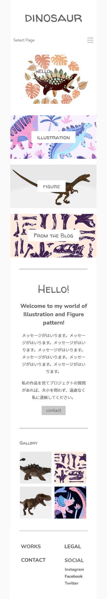
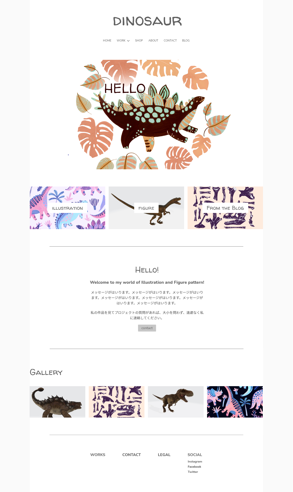
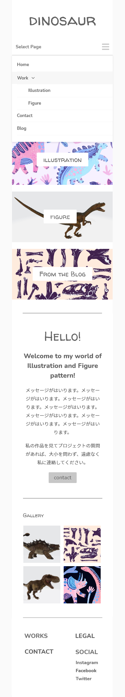

<!-- AUTO-GENERATED-CONTENT:START (STARTER) -->
<h1 align="center">
   Fictitious site
</h1>

This site is designed to look like a fictional site This site is designed to look like.

## Image Gallery

1.  **Top Page**

    
    

2.  **Nav Page**

    

## Description

This is a fictional site for Clip art of cute dinosaur, created in HTML.
When scrolling, the header is fixed and the size of the logo changes

## What's inside?

A quick look at the top-level files and directories you'll see in a HTML project.

    .
    ├── css
    ├── dist
    ├── images
    ├── js
    ├── sass
    ├── README.md
    ├── gulpfile.js
    ├── gatsby-node.js
    ├── index.html
    ├── package.json
    └── README.md

<!-- AUTO-GENERATED-CONTENT:END -->
